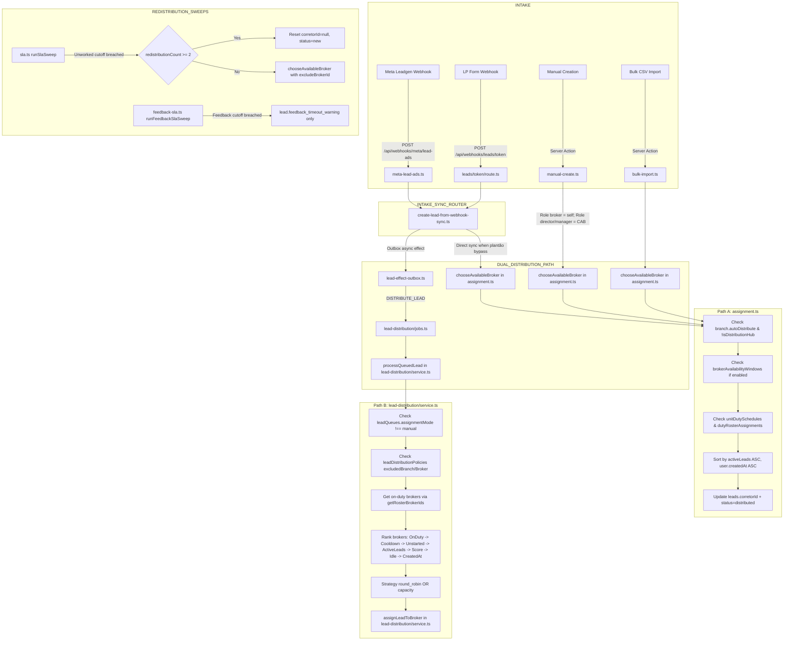
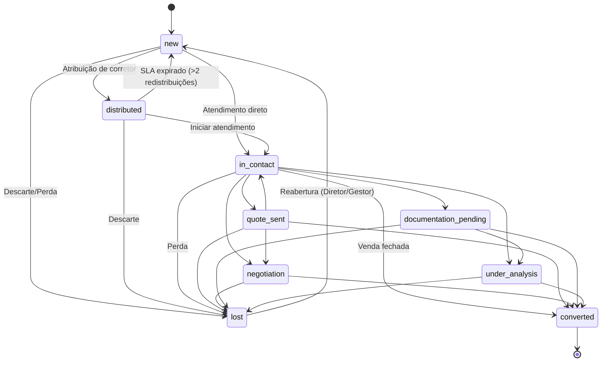
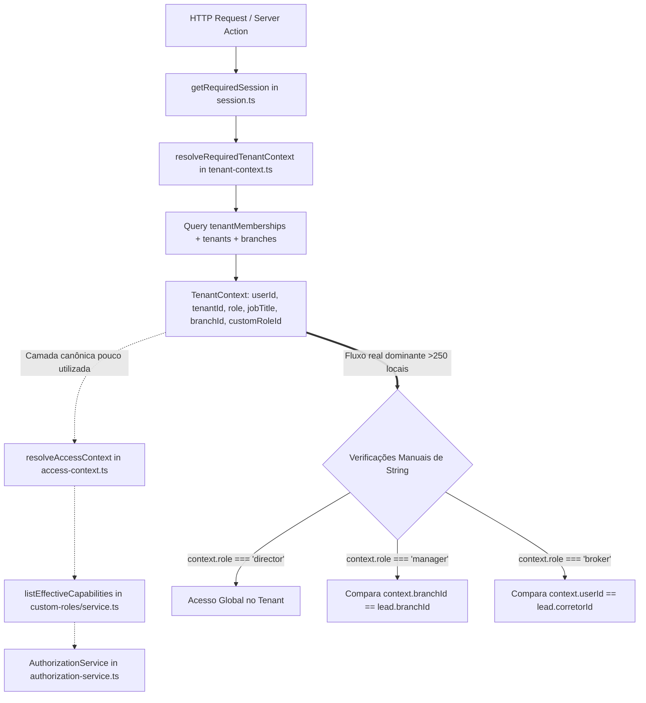

# CRM Authority Map

## 1. Executive Summary

Este documento consolida a **Auditoria Arquitetural de Autoridade e Fontes Canônicas** do CRM ÂncoraHub (CorreTop), realizada estritamente em modo de descoberta e documentação, sem alterações comportamentais ou refatorações funcionais no código-fonte.

### Estado Atual e Diagnóstico Geral
O sistema opera em produção multi-tenant e possui subsistemas avançados (Drizzle ORM, Next.js 16 App Router com Turbopack, PostgreSQL com Drizzle Migrations, Better Auth, filas transacionais com outbox pattern, integração WAHA/WhatsApp e Meta Cloud API). No entanto, o rápido crescimento de funcionalidades introduziu **fragmentação arquitetural relevante**, principalmente nas camadas de:
1. **Distribuição e Atribuição de Leads**: Coexistência de dois motores de distribuição com critérios, ordenações e restrições divergentes (`src/features/leads/assignment.ts` vs. `src/features/lead-distribution/service.ts`).
2. **Autorização, RBAC e Escopo**: Existe uma fundação canônica modelada (`AuthorizationService` + `resolveAccessContext`), porém ela é subutilizada; mais de 250 pontos no código (Server Actions, rotas e componentes) utilizam validações pontuais e imperativas baseadas em strings literais (`context.role === "director"`), ignorando custom roles e o suporte a múltiplas filiais por gestor (`tenant_manager_branches`).
3. **Pipeline e Ciclo de Vida**: A máquina de estados do funil é rigidamente declarada em `src/features/leads/lead-status-constants.ts`, mas sua ordem e visibilidade visual são controladas de forma autônoma pelo cliente via `localStorage` no Kanban, enquanto a etapa terminal `lost` é segregada das colunas operacionais.
4. **Configurações e Telas Conflitantes**: Telas legadas de redirecionamento convivem com novas centrais (ex.: `/settings/whatsapp` redirecionando para `/integrations/whatsapp`), enquanto defaults no banco diferem de defaults em fallbacks TypeScript (ex.: `aiQualificationConfigs.enabled`).

---

## 2. Domain Inventory

| Domain | Current authority | Confidence | Main writers | Main readers | UI config | Risk |
|---|---|---|---|---|---|---|
| **Distribuição de Leads** | FRAGMENTED (`leads/assignment.ts` & `lead-distribution/service.ts`) | HIGH | `management-actions.ts`, `assignment.ts`, `lead-distribution/service.ts`, `sla.ts` | `leads-workspace.tsx`, `distribution-inbox.tsx`, `routing-matrix-panel.tsx` | `/leads/distribuicao`, `/settings` (aba Distribuição) | **CRITICAL** |
| **Funil / Pipeline / Status** | `leads/lead-status-constants.ts` & `leads/change-lead-status.ts` | HIGH | `change-lead-status.ts`, `status-actions.ts`, `sla.ts` | `leads-workspace.tsx`, `leads-table.tsx`, `dashboard/data.ts` | `localStorage` (ordem/ocultação no cliente) | **HIGH** |
| **Identidade & Autenticação** | `BetterAuth` (`schema.user`, `schema.session`) | HIGH | Better Auth API routes, `session.ts` | `tenant-context.ts`, middleware | `/login`, `/recuperar-senha`, `/settings` (Segurança) | **LOW** |
| **Autorização, RBAC & Escopo** | CANONICAL FOUNDATION & DOMAIN ADAPTERS (`AuthorizationService`, `lead-authorization.ts`, `customer-authorization.ts`) | HIGH | `custom-roles/service.ts`, `equipe/actions.ts`, `leads/actions.ts`, `customers/actions.ts` | Server Actions (Leads/Clientes/Filiais/Cargos migrados), layout guards | `/equipe/cargos` | **MEDIUM (Progressive Strangler Fig)** |
| **Filiais / Unidades** | `schema.branches` & `branches/queries.ts` | HIGH | `branches/actions.ts`, `equipe/actions.ts` | `tenant-context.ts`, `branches-manager.tsx`, `unidades/[branchId]/page.tsx` | `/filiais`, `/unidades/[branchId]` | **MEDIUM** |
| **Equipe & Membros** | `schema.tenantMemberships` & `equipe/actions.ts` | HIGH | `equipe/actions.ts`, `team/invitation-token.ts` | `tenant-context.ts`, `equipe/page.tsx`, `equipe/[id]/page.tsx` | `/equipe`, `/equipe/convidar` | **MEDIUM** |
| **Qualificação por IA** | `schema.aiQualificationConfigs` & `ai-agent/service.ts` | HIGH | `ai/tenant-settings-actions.ts`, `ai-qualification/actions.ts` | `ai-agent/tenant-config.ts`, `conversation-state-machine.ts` | `/qualificacao`, `/settings` (aba IA) | **HIGH** |
| **Canais WhatsApp (Meta Cloud)** | `schema.metaCloudChannels` & `communication-channels/service.ts` | HIGH | `communication-channels/actions.ts`, `manual-meta-actions.ts` | `outbound-service.ts`, `meta-cloud-client.ts` | `/integrations/whatsapp` | **MEDIUM** |
| **Canais WhatsApp (WAHA VPS)** | `services/whatsapp-api` & `waha-connection-actions.ts` | HIGH | `waha-connection-actions.ts`, `vps-api.ts` | `waha-cadence/service.ts`, `conversas/page.tsx` | `/integrations/whatsapp` (Card WAHA) | **HIGH** |
| **Meta Ads / Leadgen** | `schema.metaLeadAdSources` & `meta-lead-ads.ts` | HIGH | `meta-lead-ads.ts`, `meta-ads/actions.ts` | `create-lead-from-webhook-sync.ts` | `/integrations/meta`, `/marketing` | **MEDIUM** |
| **Catálogo & Preços** | `schema.globalPlans`, `schema.catalogPriceTables` | HIGH | `catalog/service.ts`, `global-catalog/service.ts` | `quote-builder.tsx`, `proposals/service.ts` | `/configuracoes/tabelas` | **LOW** |
| **Cotações & Propostas** | `schema.quotes`, `schema.proposals` | HIGH | `quotes/service.ts`, `proposals/actions.ts` | `leads/[id]/page.tsx`, `propostas/page.tsx` | `quote-builder.tsx` | **LOW** |
| **Vendas & Comissões** | `schema.sales`, `schema.commissions` | MEDIUM | `sales/actions.ts`, `commissions/service.ts` | `vendas/page.tsx`, `configuracoes/comissoes` | `/vendas`, `/configuracoes/comissoes` | **MEDIUM** |
| **Notificações & Realtime** | `schema.notifications`, `realtime-sync.ts` | HIGH | `send-push-helper.ts`, `lead-effect-outbox.ts` | `notificacoes/page.tsx`, `incoming-lead-queue.tsx` | `/notificacoes`, `/settings` (Preferências) | **LOW** |
| **Feature Flags & Parâmetros** | `src/shared/feature-flags/catalog.ts` & `schema.systemSettings` | HIGH | `super-admin/actions.ts` | Toda a aplicação via `getFeatureFlag()` | `/super-admin/settings` | **LOW** |

---

## 3. Lead Distribution

### Current Execution Graph

### Definitions Found

| Rule | Location | Classification | Consumers | Conflict |
|---|---|---|---|---|
| **Direct Broker Selection** | `src/features/leads/assignment.ts:56` (`chooseAvailableBroker`) | CANONICAL (Path A) | `manual-create.ts`, `bulk-import.ts`, `marketing-import/service.ts`, `create-lead-from-webhook-sync.ts`, `sla.ts` | Ignora pesos de ranking, cooldown de 5 min e regras de roteamento multi-atributo de filas. |
| **Queue & Ranking Engine** | `src/features/lead-distribution/service.ts:380` (`processQueuedLead`) | CANONICAL (Path B) | `lead-distribution/jobs.ts`, `conversation-state-machine.ts`, `/api/internal/jobs/distribution` | Executa 6 camadas de desempate e ranking que não existem no Path A. |
| **Manual Reassignment** | `src/features/leads/management-actions.ts:44` (`reassignLeadAction`) | DUPLICATED / CONFLICTING | `lead-drawer-management-actions.tsx`, `leads-workspace.tsx` | Atualiza direto no banco, valida agenda com `checkBrokerScheduleAvailability`, emite warning; duplica `assignLeadToBroker` de `lead-distribution/service.ts:328`. |
| **Manual Assignment to Broker** | `src/features/lead-distribution/service.ts:328` (`assignLeadToBroker`) | DUPLICATED / CONFLICTING | `lead-distribution/actions.ts`, `status-actions.ts`, `agent-drawer/mcp-tools.ts` | Valida vínculo de campanha `validateCampaignQueueRoute` e restrições de fila; não executa o mesmo warning de agenda de `management-actions.ts`. |
| **Redistribution Count Limit** | `src/features/leads/sla.ts:93` (`MAX_REDISTRIBUTIONS = 2`) | HARDCODED | `sla.ts:runSlaSweep` | O limite de 2 redistribuições é uma constante literal e não respeita configurações de tenant. |
| **Feedback SLA Timeout Policy** | `src/features/leads/feedback-sla.ts:43` | SHADOW_RULE / DEAD_CONFIG | `feedback-sla.ts:runFeedbackSlaSweep` | Embora a coluna `tenants.auto_redistribute_on_feedback_timeout` exista no schema e seja verificada no loop, o código contém comentário explícito e suprime a redistribuição, gerando apenas avisos. |
| **Broker Weekly Availability Schedule** | `src/features/broker-availability/service.ts:55` | CANONICAL | `assignment.ts`, `broker-availability/actions.ts` | Persiste em `broker_availability_windows`. |
| **Unit Duty Schedule (Plantão)** | `src/features/lead-distribution/service.ts:31` & `assignment.ts:116` | DUPLICATED | `roster-queries.ts`, `assignment.ts`, `lead-distribution/service.ts` | Lógica de cálculo de fuso horário e consulta a `unit_duty_schedules` repetida com SQL idêntico em dois arquivos. |

### Current Source of Truth
**CURRENT ROOT: FRAGMENTED / DUAL-PATH**
- Operações manuais na tela de leads e webhooks síncronos usam `src/features/leads/assignment.ts`.
- Automações de IA, jobs de fila e a tela `/leads/distribuicao` usam `src/features/lead-distribution/service.ts`.

---

## 4. Pipeline / Funnel

### Stages, Order & Transitions

O pipeline é composto por 9 etapas canônicas registradas no enum do banco de dados `schema.leadStatusValues`:
1. `new` (Novo)
2. `distributed` (Distribuído)
3. `in_contact` (Em Atendimento)
4. `quote_sent` (Cotação Enviada)
5. `negotiation` (Negociação)
6. `documentation_pending` (Documentação Pendente)
7. `under_analysis` (Em Análise)
8. `converted` (Convertido — Ganho)
9. `lost` (Perdido — Perda)

### Matriz de Transições e Autoridade

### Divergências e Shadow Rules Identificadas no Funil

| Concept | Canonical Definition | Implementation Found | Classification | Risk |
|---|---|---|---|---|
| **Lista de Status na UI Kanban** | `schema.leadStatusValues` (9 status) | `src/app/(dashboard)/leads/leads-workspace.tsx:123` (`kanbanStatuses` = 8 status) | SHADOW_RULE | O status `lost` é removido das colunas do Kanban e só pode ser visto por filtros de tabela. |
| **Ordem e Visibilidade das Colunas** | `src/features/leads/lead-status-constants.ts` (`LEAD_STATUS_ORDER`) | `localStorage.getItem("ancorahub_kanban_config")` em `leads-workspace.tsx:128` | UI_AUTHORITY | Cada navegador/usuário armazena sua própria ordem de colunas do funil no cliente, sem persistência central no tenant. |
| **Validação de Transição de Etapa** | `src/features/leads/change-lead-status.ts:132` | `src/features/leads/lead-status-constants.ts:15` (`VALID_TRANSITIONS`) | CANONICAL | Validação server-side estrita impedindo saltos inválidos. |
| **Reabertura de Lead Perdido** | `src/features/leads/change-lead-status.ts:89` | Exige permissão `reabrir_lead_perdido` (Diretor/Gestor) | CANONICAL | Protegido no backend. |
| **Gatilho de Criação de Cliente** | `src/features/leads/change-lead-status.ts:250` | Insere em `schema.clients` quando transiciona para `converted` | CANONICAL | Sincronizado transacionalmente na mudança de etapa. |
| **Gatilhos de Qualificação Obrigatória** | `src/features/leads/qualification-guard.ts` | Valida se lead possui dados mínimos antes de avançar para `quote_sent` ou `converted` | CANONICAL | Bloqueia transição se faltar qualificação. |

---

## 5. Authorization / RBAC / Scope

### Fluxo Real de Resolução de Acesso

### Divergências Críticas de RBAC e Escopo

| Componente | Mecanismo de Checagem | Falha / Risco Identificado | Classificação |
|---|---|---|---|
| **Server Actions em Geral** | `if (context.role !== "director" && context.role !== "manager")` | Ignora capabilities de `customRoles` e ignora `jobTitle`. | SHADOW_RULE |
| **Múltiplas Filiais para Gestores** | `eq(table.branchId, context.branchId)` | A tabela `tenant_manager_branches` (vínculo de N filiais por gestor) nunca é consultada; o gestor fica limitado ao único `branchId` escalar de `tenant_memberships`. | CONFLICTING / ORPHAN |
| **Fastify WhatsApp API** | `x-corretop-internal-token` | Serviço separado sem conhecimento de tenant de BetterAuth; delega a responsabilidade de autorização para quem chamou via HTTP. | CANONICAL (para o serviço VPS) |
| **Super Admin Impersonation** | `getSuperAdminRoleOverride()` | Injetado dentro de `resolveRequiredTenantContext()`; sobrescreve papel quando o usuário é `isPlatformAdmin`. | CANONICAL |
| **UI Rendering vs Server Guard** | Componentes JSX condicionando botões | Botões de ação rápida checam `context.role === "director"`, mas a Server Action subjacente repete a checagem no servidor de forma consistente. | CANONICAL |

---

## 6. Other Discovered Domains

### 6.1. AI Qualification & Agent Training Center
- **Autoridade Canônica**: `src/features/ai-agent/service.ts` e `src/features/ai-qualification/service.ts`.
- **Tabelas**: `ai_qualification_configs`, `ai_qualification_sessions`, `ai_qualification_test_numbers`, `agent_behavior_versions`, `agent_training_simulations`.
- **Pontos de Risco**:
  - `src/features/ai/tenant-settings-actions.ts` persiste na tabela `ai_qualification_configs`.
  - `src/features/ai-agent/tenant-config.ts` lê da mesma tabela mas aplica defaults TypeScript diferentes do schema Drizzle.
  - Test numbers de QA são isolados das filas reais por flag `isolated_from_queues = true`.

### 6.2. WhatsApp Messaging (Meta Cloud API vs WAHA VPS)
- **Meta Cloud API**: Gerenciada por `src/features/communication-channels/service.ts`, `meta-cloud-client.ts`, configurada via Embedded Signup ou credenciais manuais (`schema.metaCloudChannels`, `schema.metaCloudTokens`).
- **WAHA VPS**: Gerenciada por `services/whatsapp-api` e `src/features/broker-workspace/whatsapp-connection.ts` (`schema.userWhatsappSessions`).
- **Conflito de Superfície**: Em `/conversas`, corretores em modo `LIGHT` são redirecionados para `/conversas/broker` se `feature_waha_connections_enabled === "true"`, enquanto diretores e gestores operam a central geral multi-canal.

### 6.3. Catálogo Global vs Catálogo Privado de Planos e Preços
- **Autoridade**: `src/features/global-catalog/` e `src/features/catalog/`.
- **Tabelas**: `global_carriers`, `global_plans`, `catalog_price_tables`, `tenant_private_carriers`, `tenant_private_plans`.
- **Comportamento**: Tenants herdam planos globais sincronizados e podem criar variações privadas que sobrepõem preços por tabela de idade.

### 6.4. Vendas, Comissões e Metas
- **Autoridade**: `src/features/sales/actions.ts`, `src/features/commissions/service.ts`, `src/features/goals/actions.ts`.
- **Tabelas**: `sales`, `commissions`, `goals`.
- **Comportamento**: O fechamento de venda (`registerSaleAction`) transiciona o lead para `converted`, calcula comissão percentual e alimenta metas mensais do corretor.

---

## 7. Duplicate Definitions Registry

| ID | Concept | Definition A | Definition B | Type | Severity | Evidence |
|---|---|---|---|---|---|---|
| **DUP-001** | Seleção de Corretor Elegível | `chooseAvailableBroker()` em `leads/assignment.ts:56` | `resolveDistributionCandidate()` em `lead-distribution/domain.ts:88` | DUPLICATED | **CRITICAL** | `assignment.ts` calcula carteira ativa básica; `lead-distribution` calcula score ponderado, cooldown de 5 min e unstarted leads. |
| **DUP-002** | Atribuição Manual de Lead | `reassignLeadAction()` em `leads/management-actions.ts:44` | `assignLeadToBroker()` em `lead-distribution/service.ts:328` | DUPLICATED | **HIGH** | Ambas gravam `lead_distribution_events`, `lead_assignment_attempts`, `audit_logs` e `lead_effect_outbox`, mas com validações e tratamentos de erro distintos. |
| **DUP-003** | Resolução de Horário de Plantão | `getLocalDutyParts()` em `leads/assignment.ts:10` | `getLocalDutyParts()` em `lead-distribution/service.ts:23` | DUPLICATED | **MEDIUM** | Funções com formatação Intl idêntica para timezone `America/Sao_Paulo` duplicadas em dois módulos. |
| **DUP-004** | Normalização de Policy de Distribuição | `readDistributionPolicy()` em `lead-distribution/domain.ts:29` | `readDistributionPolicy()` em `lead-distribution/service.ts:89` | DUPLICATED | **LOW** | Mesma função de parsing de JSON de política duplicada dentro do mesmo pacote de feature. |
| **DUP-005** | Configuração de WhatsApp Settings | `/settings/whatsapp` em `app/(dashboard)/settings/whatsapp/page.tsx` | `/integrations/whatsapp` em `app/(dashboard)/integrations/whatsapp/page.tsx` | DUPLICATED | **LOW** | `/settings/whatsapp` é uma casca vazia com redirect permanente para `/integrations/whatsapp`. |
| **DUP-006** | Configuração de Meta Settings | `/settings/meta` em `app/(dashboard)/settings/meta/page.tsx` | `/integrations/meta` em `app/(dashboard)/integrations/meta/page.tsx` | DUPLICATED | **LOW** | `/settings/meta` é uma casca vazia com redirect permanente para `/integrations/meta`. |

---

## 8. Shadow Rules Registry

| Consumer | Hidden rule | Expected owner/domain | Risk |
|---|---|---|---|
| **Kanban Board** (`leads-workspace.tsx:123`) | Oculta deliberadamente o status `lost` da lista de colunas operacionais e armazena ordem no `localStorage`. | `src/features/leads/lead-status-constants.ts` | **HIGH**: O usuário pode achar que um lead perdido desapareceu do sistema se não souber aplicar o filtro de tabela. |
| **Feedback SLA Sweep** (`feedback-sla.ts:43`) | Ignora o flag de redistribuição `tenants.auto_redistribute_on_feedback_timeout` e apenas emite warnings de interação. | `src/features/leads/feedback-sla.ts` | **HIGH**: Diretores configuram redistribuição automática na UI esperando que o lead troque de corretor, mas o worker não redistribui. |
| **Conversas Lite Broker** (`conversas/page.tsx:48`) | Redireciona forçadamente corretores com modo `LIGHT` para `/conversas/broker` somente se a flag global de WAHA estiver ativa; caso contrário, joga para `/minha-fila`. | `src/features/conversations/` | **MEDIUM**: O corretor perde acesso visual ao histórico se o WAHA estiver desligado globalmente. |
| **Unidades Breadcrumb Back** (`unidades/[branchId]/page.tsx:53`) | Redireciona botão de voltar para rotas inexistentes `/gestor` e `/corretor`. | `src/features/branches/` | **LOW**: Causa erro 404 de navegação para gestores e corretores. |

---

## 9. Hardcoded Business Rules

| Value/Rule | Locations | Intended domain | Risk |
|---|---|---|---|
| **Limite Máximo de 2 Redistribuições** (`MAX_REDISTRIBUTIONS = 2`) | `src/features/leads/sla.ts:93` | Lead Distribution Domain | **HIGH**: Hardcoded no código; impossibilita tenant de configurar tolerância maior ou menor. |
| **Cooldown de 5 Minutos entre Leads para Corretor** (`BROKER_COOLDOWN_MS = 300000`) | `src/features/lead-distribution/domain.ts:41` | Lead Distribution Domain | **MEDIUM**: Fixo no ranking; corretores que atenderam nos últimos 5 min são penalizados sem configuração visível. |
| **Pesos de Ranking Inteligente Padrão** (Conversão 45%, SLA 35%, Prioridade 20%) | `src/features/lead-distribution/domain.ts:26` | Lead Distribution Domain | **MEDIUM**: Defaults fixados no código caso não haja linha na tabela de políticas. |
| **Aviso de SLA aos 66% do Prazo** (`warningMinutes = floor(slaFirstContactMinutes * 0.66)`) | `src/features/leads/sla.ts:31` | Lead SLA Domain | **LOW**: Regra heurística de pré-alerta fixa. |

---

## 10. Configuration Sources

| Configuration | Code Default | DB Column / Setting | ENV Variable | UI Screen | Multiple sources? |
|---|---|---|---|---|---|
| **SLA Primeiro Contato (minutos)** | `15` | `tenants.sla_first_contact_minutes` | N/A | `/settings` (aba Empresa) | Sim (Code vs DB) |
| **SLA Estagnação de Etapa (dias)** | `3` | `tenants.sla_stagnant_days` | N/A | `/settings` (aba Empresa) | Sim (Code vs DB) |
| **IA Habilitada no Tenant** | `true` (em `tenant-config.ts:258`) | `ai_qualification_configs.enabled` (default `false`) | N/A | `/qualificacao`, `/settings` (IA) | **Sim (CONFLICTING)** |
| **Conexões WAHA Globais** | `"true"` | `system_settings.feature_waha_connections_enabled` | N/A | `/super-admin/settings` | Sim |
| **Meta Cloud Webhook Token** | N/A | `system_settings` | `META_WHATSAPP_WEBHOOK_VERIFY_TOKEN` | `/integrations/whatsapp` | Sim (ENV vs DB) |
| **Limite de Leads Ativos por Corretor** | `10` | `tenants.max_active_leads_limit` | N/A | `/settings` (Distribuição) | Sim |

---

## 11. UI Configuration Map

| Screen | Configuration | Canonical today? | Duplicate screen? | Consumer only? |
|---|---|---|---|---|
| `/settings` (Aba Empresa) | Nome da corretora, logo, SLAs, limite de leads | **YES** | Não | Não (Grava `schema.tenants`) |
| `/settings` (Aba Distribuição) | Políticas de fila, capacidade, exclusões | **YES** | Repetida em `/leads/distribuicao` | Não (Grava `schema.leadDistributionPolicies`) |
| `/settings/whatsapp` | Redirecionamento legado | **NO (LEGACY)** | `/integrations/whatsapp` | Sim (Apenas redirect) |
| `/settings/meta` | Redirecionamento legado | **NO (LEGACY)** | `/integrations/meta` | Sim (Apenas redirect) |
| `/integrations/whatsapp` | Conexões oficiais Meta e instâncias WAHA | **YES** | Não | Não (Grava `metaCloudChannels` e `userWhatsappSessions`) |
| `/integrations/meta` | Páginas conectadas e Lead Ads | **YES** | Não | Não (Grava `metaLeadAdSources`) |
| `/leads/distribuicao` | Filas, matriz de roteamento e plantão | **YES** | Não | Não (Grava `leadQueues`, `leadRoutingRules`) |
| `/leads/distribuicao/plantao` | Escala semanal e horários de plantão | **YES** | Não | Não (Grava `unitDutySchedules`, `dutyRosterAssignments`) |
| `/qualificacao` | Configurações do Agente IA e simulador | **YES** | Repete campos de `/settings` (IA) | Não (Grava `aiQualificationConfigs`) |

---

## 12. Authority Conflicts

### AUTH-CONFLICT-001
- **Concept**: Mecanismo de Distribuição Automática de Leads.
- **Source A**: `src/features/leads/assignment.ts:chooseAvailableBroker()`
- **Source B**: `src/features/lead-distribution/service.ts:processQueuedLead()`
- **Trigger**: Leads criados por canais síncronos (criação manual, importação CSV) vs. canais assíncronos (AI Qualification, webhook outbox).
- **Observed Behavior**: No Source A, o lead é entregue imediatamente ao corretor com menor número de leads ativos, sem considerar fila, cooldown ou score de conversão. No Source B, o lead é enfileirado e processado pelo motor de ranking avançado com 6 critérios de desempate.
- **Severity**: **CRITICAL**

### AUTH-CONFLICT-002
- **Concept**: Ativação Padrão da Qualificação por IA no Tenant.
- **Source A**: `src/shared/db/schema.ts:469` (`enabled: boolean("enabled").notNull().default(false)`)
- **Source B**: `src/features/ai-agent/tenant-config.ts:258` (`getDefaultConfig()` define `enabled: true`)
- **Trigger**: Tenant recém-criado sem linha persistida na tabela `ai_qualification_configs`.
- **Observed Behavior**: O código do agente de IA considera o assistente ativado (`true`), enquanto queries diretas ao banco ou telas que esperam o registro SQL encontram ausência ou `false`.
- **Severity**: **HIGH**

### AUTH-CONFLICT-003
- **Concept**: Tratamento de Excedimento de SLA de Feedback.
- **Source A**: `src/features/leads/sla.ts:155` (Redistribui o lead para o próximo corretor elegível e incrementa `redistributionCount`).
- **Source B**: `src/features/leads/feedback-sla.ts:44` (Apenas grava log e emite alerta de warning sem retirar o lead do corretor).
- **Trigger**: Execução periódica dos workers de SLA.
- **Observed Behavior**: Dependendo de qual worker é disparado (`runSlaSweep` vs `runFeedbackSlaSweep`), o lead pode sofrer redistribuição real ou apenas receber um alerta em tela.
- **Severity**: **HIGH**

### AUTH-CONFLICT-004
- **Concept**: Resolução de Escopo de Filiais para Gestores.
- **Source A**: `src/shared/db/schema.ts:2525` (`tenant_manager_branches` permitindo N filiais por gestor).
- **Source B**: Server Actions e Queries em `src/app/(dashboard)/` (`where(eq(schema.leads.branchId, context.branchId))`).
- **Trigger**: Gestor associado a mais de uma filial na tabela de relacionamento.
- **Observed Behavior**: O sistema enxerga apenas a filial primária vinculada em `tenant_memberships.branch_id`, tornando as demais filiais invisíveis para o gestor.
- **Severity**: **HIGH**

### AUTH-CONFLICT-005
- **Concept**: Ordem das Etapas do Funil de Vendas.
- **Source A**: `src/features/leads/lead-status-constants.ts:1` (`LEAD_STATUS_ORDER` determinando ordem canônica 0 a 8).
- **Source B**: `src/app/(dashboard)/leads/leads-workspace.tsx:128` (`localStorage.getItem("ancorahub_kanban_config")`).
- **Trigger**: Usuário reordenando ou ocultando colunas no Kanban.
- **Observed Behavior**: A ordenação do funil na interface é descolada da ordem do servidor e diverge entre diferentes dispositivos do mesmo usuário.
- **Severity**: **MEDIUM**

---

## 13. Execution Paths

### 13.1. Atribuição / Reatribuição de Lead
- **Path 1**: `src/features/leads/management-actions.ts:reassignLeadAction()` (Disparado pelo drawer de lead na tabela).
- **Path 2**: `src/features/lead-distribution/service.ts:assignLeadToBroker()` (Disparado por ações de status, MCP tools e distribuição automática).
- **Path 3**: `src/features/leads/sla.ts:runSlaSweep()` (Disparado pelo worker de SLA em lote).
- **Convergência**: Não convergem. Atualizam `schema.leads` de forma independente.

### 13.2. Transição de Status de Lead
- **Path 1**: `src/features/leads/change-lead-status.ts:changeLeadStatus()` (Disparado por select de status, stepper, conversas e kanban drop).
- **Convergência**: **CONVERGENTE**. Todos os pontos de UI e actions chamam `changeLeadStatus()`.

### 13.3. Ingestão de Webhooks de Leads
- **Path 1**: `src/app/api/webhooks/meta/lead-ads/route.ts` -> `meta-lead-ads.ts` -> `createLeadFromWebhookSync()`.
- **Path 2**: `src/app/api/webhooks/leads/[token]/route.ts` -> `createLeadFromWebhookSync()`.
- **Convergência**: **CONVERGENTE**. Ambos convergem para `createLeadFromWebhookSync()`.

---

## 14. Proposed Root Candidates

| Domain | Current state | Proposed Root | Config owner | Resolver needed? | Canonical executor |
|---|---|---|---|---|---|
| **Distribuição de Leads** | FRAGMENTED | `src/features/distribution/engine/` | Diretor / Gestor | SIM (`resolveDistributionCandidate`) | `DistributionExecutor` |
| **Funil de Vendas** | FRAGMENTED (Server constants vs LocalStorage) | `src/features/pipeline/contract.ts` | Tenant / Diretor | SIM (`resolvePipelineStages`) | `PipelineTransitionEngine` |
| **Autorização & RBAC** | FRAGMENTED (>250 role checks manuais) | `src/shared/auth/authorization-service.ts` | Super-admin / Diretor | SIM (`resolveAccessContext`) | `AuthorizationService.requirePermission()` |
| **Qualificação IA** | FRAGMENTED (Defaults conflitantes) | `src/features/ai-agent/policy.ts` | Diretor | SIM (`resolveAiPolicy`) | `AiQualificationEngine` |
| **WhatsApp Messaging** | DUAL (Meta Cloud vs WAHA) | `src/features/communication/dispatcher.ts` | Diretor / Corretor | SIM (`resolveOutboundChannel`) | `WhatsAppMessageDispatcher` |

---

## 15. Controlled Extension Candidates

| Propriedade / Configuração | Default Root | Níveis Autorizados para Override | Estratégia de Merge | Invariante? |
|---|---|---|---|---|
| **Elegibilidade de Distribuição** | Ativo se dentro do horário e abaixo da capacidade | Tenant -> Filial -> Fila | Restritiva (Interseção: se qualquer nível bloquear, bloqueia) | NÃO |
| **Limite de Leads Ativos (Capacity)** | 10 leads por corretor | Tenant -> Fila -> Usuário | Valor mais específico prevalece | NÃO |
| **Etapas do Pipeline** | 9 etapas canônicas fixas | Tenant (pode renomear rótulos ou ocultar etapas opcionais) | Herança com override de rótulos | `new` e `converted` são invariantes obrigatórios |
| **Isolamento de Tenant** | `tenantId` da sessão autenticada | Nenhum (Imutável) | N/A | **SIM (INVARIANTE ABSOLUTO)** |
| **Validação Server-Side de Escopo** | Escopo resolvido no servidor | Nenhum (Cliente nunca dita escopo) | N/A | **SIM (INVARIANTE ABSOLUTO)** |

---

## 16. Root Invariants

1. **Isolamento Multi-Tenant**: Nenhuma query, mutação ou job pode aceitar `tenantId` originado do payload do cliente sem validação estrita contra a sessão autenticada no servidor (`assertTenantAccess`).
2. **Imutabilidade de Atendimento em Andamento**: Nenhum lead com atendimento iniciado (`serviceStartedAt IS NOT NULL` ou em etapas avançadas) pode ser redistribuído automaticamente sem intervenção humana explícita de Diretor ou Gestor.
3. **Auditabilidade Universal**: Toda transferência de responsabilidade de lead deve gravar atomicamente registros em `lead_distribution_events` e `audit_logs`.
4. **Consumer Nunca Vira Autoridade**: Componentes de UI, tabelas e visualizações Kanban nunca determinam se uma transição é válida; a validação ocorre exclusivamente no domínio (`changeLeadStatus`).

---

## 17. Simplification Opportunities

| Área / Tela | O que existe hoje (Current) | O que é essencial (Essential) | O que pode ser removido/ocultado (Cleanup) | Dependência |
|---|---|---|---|---|
| `/settings/whatsapp` | Página que apenas executa redirect | `/integrations/whatsapp` | Deletar a rota `/settings/whatsapp` e atualizar links na navegação | Nenhuma |
| `/settings/meta` | Página que apenas executa redirect | `/integrations/meta` | Deletar a rota `/settings/meta` e atualizar links na navegação | Nenhuma |
| `/unidades/[branchId]` | Botão voltar com links para `/gestor` e `/corretor` (404) | Voltar para `/filiais` ou `/dashboard` | Corrigir o link de retorno para rota válida | Nenhuma |
| `leads-workspace.tsx` | Armazenamento de ordem do funil em `localStorage` | Ordem canônica do pipeline | Remover dependência de `localStorage` para ordem de etapas após unificação | Migração do Funil |
| `tenant_manager_branches` | Tabela sem nenhum reader ou writer no código | Vínculo de múltiplas filiais por gestor | Ou implementar no `tenant-context.ts` ou remover da migração se descontinuada | Decisão de Produto |

---

## 18. Migration Order

Para garantir estabilidade em produção sem interrupção operacional, a migração arquitetural futura deve seguir esta sequência estritamente faseada:

1. **Fase 1 — Fundação de Autorização & RBAC (Risco Crítico)**:
   - Adotar progressivamente `resolveAccessContext()` e `AuthorizationService` nas Server Actions principais, substituindo `context.role === "director"` literais por checagens de capability (`can("distribuir_leads")`).
   - Resolver suporte a múltiplas filiais em `tenant-context.ts`.

2. **Fase 2 — Unificação do Motor de Distribuição de Leads (Risco Crítico)**:
   - Fazer `assignment.ts` e `management-actions.ts` convergirem para um único `DistributionEngine`.
   - Parametrizar `MAX_REDISTRIBUTIONS` e alinhar `feedback-sla.ts` com as configurações de tenant.

3. **Fase 3 — Unificação do Funil e Pipeline (Risco Alto)**:
   - Consolidar `lead-status-constants.ts` como fonte canônica para todas as visualizações (Tabela, Kanban, Relatórios).
   - Eliminar discrepâncias entre a visualização de leads perdidos e o fluxo operacional.

4. **Fase 4 — Consolidação de Canais e Limpeza de Telas Redundantes (Risco Médio)**:
   - Remover rotas de redirect legadas (`/settings/whatsapp`, `/settings/meta`).
   - Alinhar defaults de IA entre o schema SQL e os helpers TypeScript.

---

## 19. Unknowns

- **UNKNOWN-001**:
  - **Question**: A tabela `tenant_manager_branches` foi planejada para suporte futuro a Gestores Multi-Filial ou é um artefato abandonado de uma tentativa anterior?
  - **Evidence checked**: `src/shared/db/schema.ts:2525`. Nenhum arquivo em `src/` realiza `select`, `insert` ou `update` nesta tabela.
  - **Why unresolved**: Não há testes nem referências documentais recentes sobre sua ativação.
  - **What would resolve it**: Decisão de produto sobre se gestores podem supervisionar múltiplas filiais simultaneamente.

- **UNKNOWN-002**:
  - **Question**: A supressão de redistribuição em `feedback-sla.ts:44` foi uma decisão intencional de produto para evitar trocas excessivas de corretor ou é uma pendência temporária?
  - **Evidence checked**: Comentário explícito em `src/features/leads/feedback-sla.ts:44` emitindo apenas warnings mesmo quando `tenant.autoRedistribute === true`.
  - **Why unresolved**: Código contradiz a configuração salva pelo Diretor em tela.
  - **What would resolve it**: Validação de negócio com o Diretor de Operações.

---

## 20. Final Risk Matrix

| Domain | Fragmentation | Security Risk | Business Risk | Change Risk | Recommended Priority |
|---|---|---|---|---|---|
| **Lead Distribution** | **CRITICAL (Dual-Path)** | MEDIUM | **CRITICAL** | HIGH | **P1** |
| **Authorization / RBAC / Scope** | **HIGH (>250 ad-hoc checks)** | **CRITICAL** | HIGH | HIGH | **P1** |
| **Pipeline / Funnel** | **MEDIUM (LocalStorage vs Code)** | LOW | HIGH | MEDIUM | **P2** |
| **AI Qualification** | **MEDIUM (Default conflicts)** | LOW | MEDIUM | LOW | **P3** |
| **WhatsApp Channels & VPS** | **MEDIUM (Meta Cloud vs WAHA)** | MEDIUM | HIGH | MEDIUM | **P3** |
| **Filiais & Equipe** | **LOW (Orphan manager branches)** | MEDIUM | MEDIUM | LOW | **P4** |
