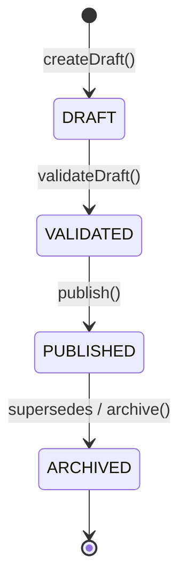
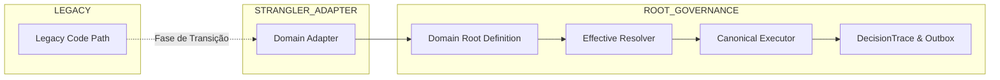

# Root Architecture

## 1. Principles

A fundação de governança arquitetural por **Domain Roots** estabelece o princípio central:

> **"Uma regra → Um dono → Uma fonte canônica → Vários consumidores."**
> 
> *Consumer nunca é autoridade.*

### Invariantes Fundamentais de Design
1. **Deny by default para extensões**: Uma propriedade de domínio não pode ser sobrescrita em nenhum escopo (`TENANT`, `UNIT`, `TEAM`, `USER`), a menos que o contrato da propriedade declare isso explicitamente em `overrideAllowedAt`.
2. **Separação estrita entre Papel (Role) e Escopo (Scope)**:
   - `Role` determina **o que** o ator pode fazer (capacidade / permissão).
   - `Scope` determina **onde** o ator pode atuar (conjunto de unidades / filiais / times).
3. **Estratégias registradas e controladas**: Não existe "Rule Builder" arbitrário na interface. A UI e a operação somente selecionam e configuram estratégias conhecidas e registradas previamente no `StrategyRegistry` pela engenharia.
4. **Resolução determinística com Provenance**: Configuração persistida no banco não é automaticamente configuração efetiva. O cálculo da configuração efetiva preserva a proveniência exata de cada propriedade (`level`, `sourceId`, `version`, `appliedStrategy`).
5. **Pureza do Resolver**: O resolvedor de configuração efetiva (`resolveEffectiveConfiguration`) é uma função pura: não executa queries de banco, não muta estado e não dispara efeitos colaterais.
6. **Consumer nunca vira Root**: UI, Server Actions, Workers, APIs, Fastify e automações de IA são apenas consumidores do contrato canônico.

---

## 2. Terminology

- **Domain Root**: A definição canônica de um domínio do CRM, contendo sua chave única, versão de contrato, defaults de fábrica, especificações de propriedade, estratégias registradas e invariantes de negócio.
- **DomainLevel**: Nível na hierarquia de escopo onde uma configuração ou override pode existir: `SYSTEM` (Root baseline) -> `TENANT` -> `UNIT` -> `TEAM` -> `USER`.
- **ResolutionStrategy**: Algoritmo que dita como o valor efetivo de uma propriedade é resolvido quando existem overrides em múltiplos níveis da hierarquia.
- **Controlled Extension**: O mecanismo pelo qual um Domain Root autoriza explicitamente quais níveis hierárquicos têm permissão para especializar uma propriedade.
- **Provenance**: Metadados de rastreabilidade que acompanham cada valor resolvido, indicando o nível de origem, ID da fonte e número da versão aplicada.
- **Effective Configuration**: O objeto de configuração final consolidado após a aplicação determinística de todos os overrides autorizados sobre os defaults do Root.
- **Canonical Executor**: O serviço ou função responsável por executar uma ação de negócio consumindo exclusivamente a `EffectiveConfiguration` e produzindo side-effects rastreáveis.
- **DecisionTrace**: Rastro auditável estruturado e expurgado de dados sensíveis (PII-free) que explica os motivos e passos que levaram a uma decisão operacional do sistema.

---

## 3. Domain Root

O Domain Root é declarado através da fábrica tipada `createDomainRoot<TConfig>()`.

```typescript
import { createDomainRoot } from "@/shared/domain-root";

export interface LeadDistributionConfig extends Record<string, unknown> {
  strategy: string;
  capacity: number;
  cooldownMinutes: number;
  tenantIsolation: boolean;
}

export const distributionDomainRoot = createDomainRoot<LeadDistributionConfig>({
  key: "lead-distribution",
  contractVersion: 1,
  criticality: "CRITICAL",
  defaults: {
    strategy: "CAPACITY",
    capacity: 10,
    cooldownMinutes: 5,
    tenantIsolation: true,
  },
  strategies: [
    { key: "ROUND_ROBIN", technicalLabel: "Distribuição Circular" },
    { key: "CAPACITY", technicalLabel: "Distribuição por Capacidade Livre" },
  ],
  properties: {
    strategy: {
      key: "strategy",
      resolutionStrategy: "NEAREST_OVERRIDE_WINS",
      overrideAllowedAt: ["TENANT", "UNIT"],
    },
    capacity: {
      key: "capacity",
      resolutionStrategy: "NEAREST_OVERRIDE_WINS",
      overrideAllowedAt: ["TENANT", "UNIT", "USER"],
      validator: (val) => ({
        valid: typeof val === "number" && val > 0,
        error: "Capacidade deve ser maior que zero",
      }),
    },
    cooldownMinutes: {
      key: "cooldownMinutes",
      resolutionStrategy: "ROOT_ONLY",
      overrideAllowedAt: [], // Imutável fora do Root
    },
    tenantIsolation: {
      key: "tenantIsolation",
      resolutionStrategy: "RESTRICTIVE_INTERSECTION",
      overrideAllowedAt: ["TENANT"],
    },
  },
  invariants: [
    {
      name: "TENANT_ISOLATION_MANDATORY",
      description: "Isolamento multi-tenant nunca pode ser afrouxado",
      check: (config) => ({
        valid: config.tenantIsolation === true,
        reason: "tenantIsolation deve permanecer estritamente true",
      }),
    },
  ],
});
```

---

## 4. Strategies

As estratégias permitidas para um domínio são gerenciadas pelo `StrategyRegistry`.
- Impede registro de chaves duplicadas (`DuplicateStrategyError`).
- Impede recuperação ou execução de estratégias desconhecidas (`UnknownStrategyError`).
- Valida o payload de configuração específico da estratégia via schemas declarados.
- Não acopla JSX ou componentes de UI.

---

## 5. Controlled Extensions

O contrato de extensão controlada rejeita qualquer tentativa de especialização fora dos níveis permitidos:

| Propriedade Exemplo | `overrideAllowedAt` | Tentativa em `TENANT` | Tentativa em `UNIT` | Tentativa em `USER` |
|---|---|---|---|---|
| `cooldownMinutes` | `[]` | ❌ Rejeitado (`OverrideNotAllowedError`) | ❌ Rejeitado | ❌ Rejeitado |
| `strategy` | `["TENANT", "UNIT"]` | ✅ Autorizado | ✅ Autorizado | ❌ Rejeitado (`OverrideNotAllowedError`) |
| `capacity` | `["TENANT", "UNIT", "USER"]` | ✅ Autorizado | ✅ Autorizado | ✅ Autorizado |

---

## 6. Resolution Strategies

O `resolveEffectiveConfiguration` suporta quatro estratégias fundamentais:

1. **`ROOT_ONLY`**:
   O valor é estritamente o default do Root. Qualquer tentativa de override em escopos inferiores lança `OverrideNotAllowedError`.
2. **`NEAREST_OVERRIDE_WINS`**:
   O nível mais específico na hierarquia vence (`USER` -> `TEAM` -> `UNIT` -> `TENANT` -> `SYSTEM`). Se a Unidade não definir override, o valor herda do Tenant; se o Tenant não definir, herda do Root.
3. **`RESTRICTIVE_INTERSECTION`**:
   - Para booleanos: política deny-first (se qualquer nível declarar `false`, o resultado é `false`).
   - Para conjuntos/arrays: calcula a interseção estrita dos elementos autorizados entre todos os níveis.
4. **`MERGE`**:
   Merge previsível e raso de objetos ou execução de `mergeCustomizer` declarado, sem mutações mágicas profundas.

---

## 7. Provenance

Todo valor resolvido preserva seu rastro de proveniência:

```typescript
{
  value: 6,
  provenance: {
    level: "UNIT",
    sourceId: "unit-sp-centro",
    version: 3,
    appliedStrategy: "NEAREST_OVERRIDE_WINS"
  }
}
```

Isso permite que a UI e os logs respondam com exatidão:
- *"Valor herdado da corretora (Tenant)"*
- *"Valor especializado para esta Unidade (Versão 3)"*
- *"Valor de fábrica do sistema"*

---

## 8. Versioning

Configurações operacionais críticas seguem o modelo de versionamento imutável:



- Cada versão armazena: `id`, `domainKey`, `scopeLevel`, `scopeId`, `version`, `status`, `config`, `createdBy`, `createdAt`, `validatedAt`, `publishedAt`, `supersedesVersionId`.
- Versões antigas nunca são sobrescritas fisicamente no banco; são arquivadas para auditoria e histórico de rollback.

---

## 9. Publication

- **Configurações `SIMPLE`**: Podem ser validadas e publicadas diretamente a partir do estado `DRAFT`.
- **Configurações `CRITICAL`**: Exigem obrigatoriamente a passagem pelo estado `VALIDATED` antes de permitir a publicação (`InvalidVersionStateError`).
- A publicação de uma nova versão ativa para um escopo automaticamente arquiva a versão publicada anterior daquele mesmo escopo.

---

## 10. Effective Configuration

A resolução de configuração efetiva combina o Root com os overrides persistidos:

```typescript
const effective = resolveEffectiveConfiguration({
  root: distributionDomainRoot,
  context: { tenantId: "tenant-1", unitIds: ["unit-alpha"] },
  overrides: [tenantOverride, unitOverride],
});

console.log(effective.config.capacity); // 6
console.log(effective.provenanceMap.capacity.level); // "UNIT"
```

---

## 11. Canonical Executor

O Canonical Executor é o único componente autorizado a realizar efeitos colaterais no banco e integrações externas para um domínio.
- **Entrada**: `EffectiveConfiguration` + Contexto Seguro Server-Side.
- **Processamento**: Avaliação da estratégia ativa registrada.
- **Saída**: Mutação transacional no banco + `DecisionTrace` estruturado + eventos no Outbox.

---

## 12. Decision Trace

O `DecisionTrace` fornece explicabilidade total sobre cada decisão sem expor dados pessoais ou credenciais:

```typescript
import { createDecisionTrace } from "@/shared/domain-root";

const trace = createDecisionTrace({
  domain: "lead-distribution",
  action: "assign_lead",
  rootContractVersion: 1,
  effectiveStrategy: "CAPACITY",
  inputs: { leadId: "lead-123", telefone: "+5511999998888" }, // telefone será [REDACTED]
  decisions: [
    { step: "ON_DUTY_FILTER", evaluation: "2 corretores no plantão", outcome: "ACCEPTED" },
    { step: "CAPACITY_CHECK", evaluation: "Corretor A atingiu limite", outcome: "SKIPPED" },
    { step: "FINAL_SELECTION", evaluation: "Corretor B selecionado", outcome: "ACCEPTED" },
  ],
  result: { assignedBrokerId: "broker-b" },
});
```

Chaves como `cpf`, `phone`, `telefone`, `email`, `token`, `secret`, `password`, `senha` e `message` são automaticamente expurgadas (`[REDACTED]`).

---

## 13. UI Ownership

A interface com o usuário nunca dita regras nem determina autoridade:
- A UI consulta metadados via `computeFieldMetadata()` para saber se um campo é editável no escopo atual, se é herdado e quais níveis podem alterá-lo.
- Cada configuração de negócio possui **uma única tela Home canônica**. Telas secundárias apenas exibem o valor efetivo com link para a Home de configuração.

---

## 14. Security Invariants

1. **Isolamento de Tenant Imutável**: Nenhuma query ou resolução pode aceitar `tenantId` enviado pelo payload do cliente sem validação contra a sessão server-side (`getRequiredTenantContext()`).
2. **Escopo Resolvido no Servidor**: O cliente nunca envia o escopo onde tem permissão de atuar. O servidor deriva o escopo das associações em banco.
3. **Invariantes Raiz Invioláveis**: Invariantes declaradas no Root definition (`invariants`) não podem ser desativadas ou enfraquecidas por nenhum override.

---

## 15. Examples

Consulte o arquivo de testes unitários [`src/shared/domain-root/domain-root.test.ts`](file:///c:/Users/kyper/Desktop/Kyper/Projects/ancorahub/src/shared/domain-root/domain-root.test.ts) para 17 exemplos executáveis cobrindo todo o ciclo de vida.

---

## 16. How to Add a New Domain Root

1. Crie o diretório do domínio em `src/features/<nome-do-dominio>/`.
2. Declare a interface de configuração `interface MyDomainConfig extends Record<string, unknown>`.
3. Crie a definição Root com `createDomainRoot<MyDomainConfig>()`, declarando defaults, criticality, specs de propriedade e invariantes.
4. Registre o Root no catálogo global via `domainRootRegistry.register(myDomainRoot)`.
5. Crie o Canonical Executor consumindo a `EffectiveConfiguration`.
6. Crie os testes unitários e de integração validando os cenários do domínio.

---

## 17. Anti-Patterns

Os seguintes padrões são **estritamente proibidos** na arquitetura do CorreTop:

1. **`context.role === "director"` espalhado como regra de domínio**:
   Checagens manuais de string soltas em Server Actions ignoram custom roles, capabilities e escopos multi-filial.
2. **UI como autoridade**:
   Componentes JSX ou `localStorage` decidindo ordem de funil, permissões ou elegibilidade de distribuição.
3. **Consumer criando regra própria**:
   Workers ou webhooks implementando lógica paralela de atribuição que não existe no Canonical Executor.
4. **Defaults duplicados e conflitantes**:
   Definir defaults em código TypeScript que divergem dos defaults do schema SQL da tabela.
5. **Mutação direta no banco pulando o executor**:
   Executar `db.update(schema.leads)` direto de uma Server Action sem passar pelo Domain Executor e sem gerar `DecisionTrace` ou `audit_logs`.
6. **Worker com política oculta (Shadow Rule)**:
   Workers verificando flags de banco mas suprimindo o comportamento real através de código comentado ou hardcodes.
7. **Webhook com roteamento próprio**:
   Webhooks síncronos entregando leads por algoritmos diferentes dos webhooks assíncronos.
8. **Telas de configuração duplicadas**:
   Criar duas páginas com formulários que gravam na mesma tabela sem hierarquia canônica.
9. **Deep Merge mágico irrestrito**:
   Mesclar objetos complexos cegamente sem contrato de extensão e sem rastrear proveniência.
10. **Overrides não declarados**:
    Permitir que usuários ou unidades configurem propriedades marcadas como imutáveis no Root.
11. **Catch silencioso que converte Deny em Allow**:
    Engolir erros de autorização ou de domínio em blocos `try/catch` vazios e assumir permissão concedida.

---

## 18. Migration Strategy

A migração dos domínios legados para a nova arquitetura seguirá o padrão Strangler Fig (incremental, não-destrutivo e orientado a fases):



Cada domínio será migrado individualmente em PRs isolados, iniciando pela fundação de RBAC/Permissões e Distribuição de Leads.
