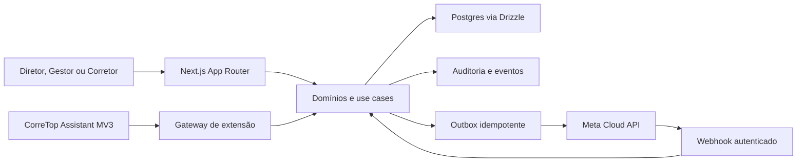

# Contexto Técnico do CorreTop

```mermaid
flowchart LR
  User["Diretor, Gestor ou Corretor"] --> App["Next.js App Router"]
  Extension["CorreTop Assistant MV3"] --> Gateway["Gateway de extensão"]
  App --> Domain["Domínios e use cases"]
  Gateway --> Domain
  Domain --> DB["Postgres via Drizzle"]
  Domain --> Audit["Auditoria e eventos"]
  Domain --> Outbox["Outbox idempotente"]
  Outbox --> Meta["Meta Cloud API"]
  Meta --> Webhook["Webhook autenticado"]
  Webhook --> Domain
```

Tenant, papel, unidade e carteira entram no domínio por sessão ou canal autenticado. O
fluxo nunca usa um valor de tenant enviado pelo browser como autoridade.
