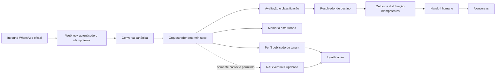

# Plano de upgrade do Chat e da Qualificação por IA

**Status:** proposto para implementação em ondas  
**Data:** 15 de agosto de 2026  
**Escopo:** centralizar configuração, simulação, monitoramento e ajustes da IA em `/qualificacao`, preservando `/conversas` como a experiência operacional de atendimento humano.

## 1. Decisão de produto e limites

### Resultado esperado

`/conversas` continua sendo a caixa operacional: o corretor consulta sua carteira, lê o histórico autorizado, assume o atendimento e conduz a conversa humana. Não haverá editor de prompt, regras da IA ou configuração do motor nessa rota.

`/qualificacao` torna-se a central de comando do atendimento automatizado: perfil de qualificação, mensagens, simulador, diagnóstico do canal, regras de roteamento, elegibilidade, permissões de ferramentas, saúde operacional, alertas e consulta de conhecimento recuperável.

### Invariantes

1. O servidor sempre deriva tenant, papel, unidade e carteira. Nenhum identificador enviado pelo navegador, webhook ou extensão é autoridade de escopo.
2. A IA pode extrair dados e redigir respostas dentro de limites; ela nunca escolhe estado, próxima pergunta, score, destino, responsável ou transferência.
3. Resposta automática somente ocorre após inbound no WhatsApp oficial. Lead de landing page não recebe mensagem automática sem consentimento aplicável e template Meta aprovado.
4. Follow-up permanece **configurável, porém sem executor de envio** nesta entrega. Nenhuma regra cria outbox, agenda disparo ou envia reengajamento até decisão de LGPD, janela de 24 horas, opt-out e templates aprovados.
5. Todo efeito externo usa outbox idempotente; toda mudança administrativa é validada no servidor, auditada, reversível e coberta por kill switch global do Super-admin.
6. Logs, auditoria, métricas e alertas não registram corpo de mensagem, telefone, prompt, token, payload de webhook ou embedding.

### Decisões e regras que o plano preserva

- DEC-050, DEC-053, DEC-054, DEC-055, DEC-056, DEC-070, DEC-077 e DEC-078.
- BR-001 a BR-005, BR-058 a BR-062 e BR-029I.
- A configuração comercial por tenant fica em `/qualificacao`; modelo, provedor, embeddings, rollout e controles globais permanecem sob Super-admin.

## 2. Diagnóstico a corrigir

| ID | Situação atual | Risco | Resultado da migração |
|---|---|---|---|
| D1 | Campos, ordem e validação existem em mais de uma fonte (`ai-agent`, `ai-qualification` e treinamento). | Perguntas repetidas, puladas ou divergentes. | Um perfil publicado por tenant é a única especificação executável. |
| D2 | `ai_conversations` e `ai_qualification_sessions` dividem responsabilidade de sessão. | Estado e histórico divergentes. | Uma conversa canônica; projeções legadas apenas durante a transição. |
| D3 | A próxima pergunta ainda depende parcialmente do LLM. | Fluxo não previsível. | Orquestrador determinístico seleciona e valida a próxima etapa. |
| D4 | Rota por temperatura pode não ser aplicada pelo motor de distribuição. | Lead HOT chega à fila errada. | Toda conclusão passa pelo resolvedor de destino antes do job de distribuição. |
| D5 | Handoff não possui contrato único completo. | Corretor perde contexto e não há explicação uniforme. | Payload versionado com resumo, score, motivos, campos, destino e versão de perfil. |
| D6 | Follow-up pode parecer operacional antes de haver autorização. | Risco de LGPD e Meta. | Regras persistem apenas como rascunho; executor fica bloqueado. |
| D7 | A camada de conhecimento já possui documentos e chunks, mas o schema do aplicativo ainda não declara embedding vetorial nem busca semântica. | RAG incompleto ou inseguro. | Busca vetorial server-side, escopada e rastreável, em onda independente. |
| D8 | Extração permissiva pode interpretar uma cidade, número ou e-mail como `customerName`. | Lead recebe nome corrompido e a IA trata o cliente pelo local informado. | Guardrail determinístico de entidade e validação contextual pelo campo atualmente perguntado. |
| D9 | O fechamento pode marcar a conversa como humana antes da confirmação de envio da mensagem final. | Cliente fica sem confirmação e o atendimento aparenta estar transferido. | Contrato de fechamento: registrar mensagem, confirmar o provider e só então mudar para `WAITING_HUMAN`. |

## 3. Arquitetura-alvo

### Responsabilidades canônicas

| Componente | Responsabilidade | Não pode fazer |
|---|---|---|
| Perfil de qualificação | Campos, dependências, validações, retries, pesos, mensagens e versão. | Escolher corretor ou alterar conversa já iniciada. |
| Orquestrador | Transições, próxima pergunta, persistência de resposta, bloqueios e efeitos idempotentes. | Consultar dados de outro tenant ou delegar decisões ao LLM. |
| IA | Extrair dados e formular resposta contextual dentro do perfil. | Criar regra de negócio, afirmar condição comercial ou executar ação crítica. |
| RAG vetorial | Recuperar trechos publicados e permitidos para o tenant. | Ser fonte de verdade para preço, cobertura, carência, rede ou promoção. |
| Qualification Engine | Score, classificação, resultado e handoff estruturado. | Bypassar o resolvedor central de distribuição. |
| `/qualificacao` | Configurar, simular, monitorar, explicar e auditar. | Enviar mensagens de atendimento ou substituir `/conversas`. |
| `/conversas` | Atendimento humano e visualização do handoff. | Editar política, prompt ou configurações da IA. |

## 4. Uso do Supabase Vector / pgvector

O Supabase vetorial será usado como **recuperação de conhecimento**, não como memória de controle da conversa. A memória estruturada e a máquina de estados permanecem no PostgreSQL relacional/JSONB, pois são auditáveis e determinísticas.

### O que entra no índice

- Documentos publicados e autorizados do tenant: playbooks, FAQ interno, orientação institucional e materiais aprovados.
- Metadados mínimos: `tenant_id`, coleção, documento, versão, nível de autoridade, status, vigência e categoria.
- Nunca: transcrição bruta de conversas, telefones, documentos sensíveis, tokens, dados de saúde ou dados pessoais não necessários.

### Contrato de busca

1. A solicitação do agente chega ao servidor com `tenantId` derivado do canal autenticado.
2. O servidor gera ou solicita embedding apenas para a consulta mínima necessária.
3. A busca filtra obrigatoriamente `tenant_id`, `published`, vigência, coleção autorizada e nível de autoridade antes de ordenar por similaridade.
4. O agente recebe poucos trechos, com referência de origem e versão; o resultado não autoriza promessa comercial nem substitui o perfil determinístico.
5. A consulta e a origem utilizada geram telemetria sem texto, sem vetor e sem PII.

### Pré-requisitos verificáveis

- Confirmar no projeto Supabase a extensão `vector`, a dimensão compatível com o provedor homologado e limites de custo/latência.
- Criar migração versionada para a coluna de embedding, índice vetorial apropriado e função SQL/RPC privada de busca. A função deve receber tenant e filtros do servidor; o navegador não a chama diretamente.
- Criar fila de ingestão idempotente: documento publicado -> chunking -> embedding -> indexação -> estado `ready` ou `failed`.
- Manter fallback seguro: se o índice, embedding ou provedor falhar, o atendimento continua sem RAG, não inventa informação e registra alerta operacional.

### Critérios de aceite do RAG

- Um documento publicado do Tenant A nunca é recuperado em consulta do Tenant B.
- Documento arquivado, fora da vigência ou sem coleção autorizada não aparece.
- A mesma pergunta com RAG indisponível retorna fallback seguro, sem quebrar o fluxo de qualificação.
- O simulador informa fontes recuperadas apenas para usuário autorizado e sem expor conteúdo sensível indevido.
- Teste de performance mede p95 de recuperação e bloqueia rollout se exceder o orçamento definido antes da fase.

## 5. Ondas de implementação

### Onda 0 — Contrato, baseline e proteção de rollout

1. Registrar a decisão de centralização em `docs/decision-log.md` e criar o registro ativo de implementação.
2. Inventariar leitores e gravadores de `ai_conversations`, `ai_qualification_sessions`, memória, status do lead, fila e outbox.
3. Introduzir feature flags independentes: orquestrador v2, roteamento v2, RAG, simulador v2 e UI centralizada. Flags de tenant nunca substituem kill switch global.
4. Definir contratos tipados para perfil, estado, resposta validada, decisão de rota e handoff.

**Aceite:** a flag desligada conserva integralmente o fluxo atual; ativar uma flag não cria mensagem nem altera conversa existente.

### Onda 1 — Perfil publicado e versão imutável

1. Consolidar campos obrigatórios, ordem, condições, validadores, retries, mensagens de correção, pesos e critérios de classificação em um perfil por tenant.
2. Diretor cria rascunho, roda cenários sintéticos e publica uma única versão ativa. Gestor recebe somente permissões delegadas de consulta/operacionais; Super-admin mantém controles técnicos.
3. Conversa iniciada fixa `profileVersion`; publicação e rollback afetam apenas novas conversas.
4. Remover arrays estáticos e prompts como fonte de regra, preservando adaptadores de compatibilidade temporários.

**Aceite:** publicar v2 não muda sessão v1; rollback para v1 cria sessão nova com v1; alterações sem publicação não têm efeito no webhook.

### Onda 2 — Orquestrador determinístico de qualificação

1. Implementar a máquina de estados: `new`, `started`, `waiting_answer`, `validating`, `in_progress`, `completed`, `failed`, `waiting_human`, `human_assumed` e `closed`.
2. `getNextQuestion` usa exclusivamente perfil + memória validada. A IA recebe a pergunta selecionada, nunca uma instrução aberta para decidir a próxima.
3. Validar resposta, registrar tentativa e persistir dados em transação; após limite, transferir ao humano com motivo seguro.
4. Criar chaves idempotentes por pergunta, conclusão, rota, handoff e mensagem final. Lock otimista evita efeitos duplicados em mensagens concorrentes.
5. Aplicar Name Entity Guard: `customerName` exige nome completo explícito ou resposta compatível com a pergunta de nome; cidade/estado, número isolado e e-mail nunca preenchem esse campo. Uma resposta ao campo `city` não pode atualizar `customerName`.

**Aceite:** fluxo familiar completo, resposta com múltiplos campos, correção de campo, retry esgotado, opt-out, pedido de humano, mídia e mensagem duplicada são determinísticos e não duplicam outbox. O caso `Petrópolis` quando a pergunta atual é cidade persiste somente cidade; `42` ou e-mail não viram nome.

### Onda 3 — Resultado, destino, distribuição e handoff

1. O Qualification Engine calcula score e classificação a partir de perfil publicado; limiares e regras explicáveis ficam versionados.
2. Conclusão chama obrigatoriamente `resolveQualificationDestination`; somente depois cria job de distribuição idempotente.
3. Resolver devolve decisão explicável: destino, candidatos, exclusões, fallback, SLA e versão da regra.
4. Persistir handoff imutável com campos autorizados, score, razões, resumo determinístico, destino e referências de auditoria.
5. Ao assumir no atendimento, a IA é pausada; retomar depende de papel autorizado, condição válida e auditoria.
6. Fechar em duas etapas idempotentes: criar `whatsappMessages` pendente, obter confirmação do provider e registrar o `messageId` real; só então persistir fechamento enviado e transitar para `WAITING_HUMAN`. Falha de envio preserva estado recuperável e gera alerta, sem simular transferência.

**Aceite:** HOT/WARM/COLD/não qualificado usam destinos distintos; sem corretor mantém fila recuperável; corretor da carteira vê resumo, mas não dados fora do escopo. O último e-mail pendente sempre gera uma mensagem final confirmada antes da transferência humana.

### Onda 4 — Central `/qualificacao`

1. Organizar o hub por responsabilidades: Visão geral; Perfil e mensagens; Simulador; Canais e saúde; Destinos; Elegibilidade; Ferramentas; Conhecimento; Alertas; Follow-up preparado.
2. Usar Server Components para carga escopada e Server Actions para mutações autorizadas; a aba ativa permanece em `?tab=`.
3. Exigir confirmação para publicação, rollback, pausa e operações de impacto. Cada tela cobre carregamento, vazio, erro, permissão negada e indisponibilidade.
4. Remover de `/conversas` controles que configuram IA; manter somente link contextual para a configuração, quando o papel permitir.

**Aceite:** Diretor altera apenas o próprio tenant; Gestor respeita unidade e permissões; Corretor não edita configuração; cada ação deixa evento de auditoria com ator, escopo, versão e resultado.

### Onda 5 — Simulador e avaliação contínua

1. O simulador usa o mesmo perfil, validadores, orquestrador e, quando habilitado, o mesmo gateway de RAG; nunca cria lead, conversa real ou outbox.
2. Manter cenários publicados: respostas válidas, inválidas, múltiplas, pedido de humano, opt-out, contexto de conhecimento e indisponibilidade de vetor.
3. Executar avaliações antes de publicar perfil: aderência à ordem, taxa de campos válidos, tentativa de promessas comerciais, recuperação de fonte e comportamento de fallback.

**Aceite:** cenário aprovado é reproduzível; falha bloqueia publicação; resultado registra versão de perfil, versão de conhecimento e motor utilizado, sem textos sensíveis.

### Onda 6 — Observabilidade e operação

1. Padronizar eventos: início, pergunta selecionada, resposta aceita/rejeitada, campo salvo, conclusão, classificação, rota resolvida, falha de rota, handoff, fechamento e fallback de RAG.
2. Criar alertas para sessão travada, qualificado sem rota, outbox falho, canal indisponível, queda de taxa de conclusão, falha de ingestão vetorial e custo/latência acima do limite.
3. Dar ao Diretor visibilidade do próprio tenant e ao Gestor somente da unidade. Exceções centrais pertencem ao Diretor; Super-admin vê a saúde global.

**Aceite:** alertas não expõem PII, podem ser reconhecidos com auditoria e apontam para uma ação recuperável.

### Onda 7 — Migração, piloto e retirada do legado

1. Ler o formato novo e antigo em paralelo, com comparação de paridade somente em dados sintéticos ou metadados permitidos.
2. Migrar em lotes idempotentes; nunca apagar sessões ou mensagens. Manter adaptador de leitura legado até métricas de paridade aprovadas.
3. Ativar por tenant piloto, acompanhar duplicidade, erro de rota, tempo até handoff, falha de outbox e p95 de RAG.
4. Só então remover caminhos legados, com migração de retirada separada e rollback documentado.

**Aceite:** kill switch interrompe novas sessões e RAG sem apagar histórico; rollback não perde conversa, handoff ou trabalho em fila.

## 6. Matriz obrigatória de testes

| Camada | Casos mínimos |
|---|---|
| Unitário | Perfil e versão; validadores; Name Entity Guard (cidade, estado, número e e-mail); transições válidas/inválidas; próxima pergunta; retries; score 49/50/79/80; classificação; destino; handoff; filtros de RAG. |
| Integração | Webhook assinado -> deduplicação -> conversa -> qualificação -> rota -> distribuição -> handoff; mensagem final confirmada antes de `WAITING_HUMAN`; falha de outbox; lock concorrente; opt-out; mídia; pedido de humano; canal pausado. |
| Segurança | Tenant cruzado, unidade cruzada, carteira cruzada, papel inadequado, ID enviado pelo cliente e acesso direto a RPC vetorial. Todos devem falhar sem revelar existência do recurso. |
| RAG | Isolamento de tenant, status/vigência, coleção permitida, recuperação vazia, indisponibilidade do vetor, fonte correta e ausência de PII na telemetria. |
| Interface | Permissões, URL de abas, estados vazio/carregando/erro/indisponível, confirmação/rollback, teclado, foco, contraste, viewport estreito e movimento reduzido. |
| E2E | Simulador completo sem efeitos externos; inbound oficial com qualificação completa; handoff visível em `/conversas`; IA bloqueada após assunção humana; flags e rollback. |
| Migração | Backfill repetido, paridade de leitura, coexistência v1/v2, sessão antiga preservada e nenhuma duplicação de outbox. |

### Portões de qualidade

1. A cada onda: testes focados, type-check e `npm run agent:verify -- --level fast`.
2. Antes de piloto: testes de integração/E2E pertinentes, `npm run agent:verify -- --level full`, lint e build de produção.
3. Antes de ampliar rollout: métricas do piloto dentro do orçamento definido, zero incidente P0 de isolamento, zero duplicidade de fechamento/handoff e nenhum alerta crítico aberto.
4. Encerramento: evidência em `reports/agent/verification/`, registro concluído em `docs/implementations/completed/`, decisão/documentação atualizadas e roadmap marcado com escopo e testes reais.

## 7. Rollback e exclusões explícitas

### Rollback

- Desligar `rag` remove somente contexto recuperável; o fluxo determinístico continua.
- Desligar `orchestrator_v2` impede novas sessões v2 e mantém as existentes no adaptador compatível até encerramento.
- Desligar capacidade global ou tenant interrompe novas automações sem apagar conversas, perfil, auditoria, fila ou handoff.
- Reverter versão de perfil afeta apenas novas conversas; não reescreve fatos já persistidos.

### Fora desta entrega

- Não migrar o atendimento operacional de `/conversas` para `/qualificacao`.
- Não liberar reengajamento automático/follow-up.
- Não permitir que RAG responda preço, cobertura, carência, rede, promoção ou condição comercial.
- Não indexar conversas brutas ou dados pessoais sensíveis.
- Não permitir que IA altere responsável, status ou transferência sem confirmação humana autorizada.

## 8. Ordem recomendada de execução

`Onda 0 -> Onda 1 -> Onda 2 -> Onda 3 -> Onda 4 -> Onda 5 -> Onda 6 -> Onda 7`.

O RAG vetorial deve entrar entre as Ondas 4 e 5 somente depois da verificação técnica do Supabase e da fila de ingestão. Ele melhora contexto e simulação, mas não bloqueia a correção do fluxo determinístico, do roteamento e do handoff.
