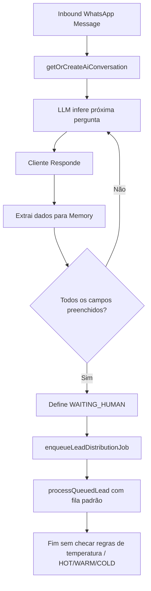
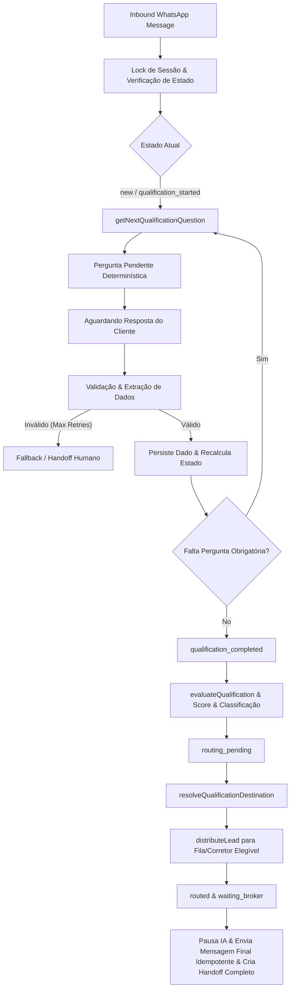

# Auditoria do Fluxo de Qualificação de Leads por IA (CorreTop / ÂncoraHub)

Data: 11 de Agosto de 2026  
Versão da Auditoria: 1.0  
Status: Auditoria Concluída — Aguardando Aprovação do Plano para Reforço do Fluxo

---

## 1. Mapeamento do Fluxo Atual (As-Is)

### 1. Onde o atendimento começa
O atendimento via WhatsApp entra por 3 rotas de webhook dependendo da infraestrutura do tenant:
- **Meta Cloud API Oficial**: `src/features/communication-channels/service.ts` (`handleMetaWebhook`).
- **OpenWA (Legado)**: `src/app/api/webhooks/openwa/[tenantId]/route.ts`.
- **WAHA Cadence**: `src/features/waha-cadence/inbound.ts`.

Se o contato (telefone) não corresponder a nenhum lead existente, um novo lead é criado com `status: "new"` e é enfileirado para distribuição básica (`enqueueLeadDistributionJob`).

### 2. Como a sessão de qualificação é criada
A conversa/sessão é criada/recuperada através de `getOrCreateAiConversation` em `src/features/ai-agent/conversation-state-machine.ts`:
- Cria um registro em `ai_conversations` com `status: "NEW"`, `lock_version: 1`, `automation_state: "AI_ACTIVE"`.
- *Divergência identificada*: Existe uma segunda tabela e serviço em paralelo (`ai_qualification_sessions` em `src/features/ai-qualification/service.ts`), gerando duplicação de responsabilidade de sessão entre o agente de conversa geral e a engine de qualificação.

### 3. Onde as perguntas são definidas
As perguntas/campos obrigatórios estão definidos em 3 locais:
1. `AgentBehaviorPolicy` (`src/features/agent-training/service.ts`): Define `requiredFields` (`['customerName', 'planType', 'numberOfLives', 'age', 'city', 'email']`) e pesos por campo.
2. `COLLECTIBLE_FIELDS` (`src/features/ai-agent/memory.ts`): Mapeia chaves para rótulos de prompt (`promptLabel`) e expressões regulares de extração.
3. Array estático em `src/features/ai-qualification/service.ts`: `['city', 'plan', 'beneficiaries', 'urgency']`.

### 4. Como a IA decide qual pergunta fazer
Atualmente, o fluxo repassa o histórico de mensagens e o `memoryContext` (campos já coletados) para o modelo de IA (via `generateAiResponse` em `src/features/ai-agent/service.ts`). O LLM decide o texto da mensagem com base no prompt de sistema ("faça apenas uma pergunta por vez").  
*Divergência Crítica*: A seleção da próxima pergunta depende parcialmente da escolha não-determinística do LLM, permitindo que a IA pule perguntas obrigatórias, repita perguntas ou faça perguntas fora de ordem.

### 5. Como o sistema identifica perguntas já respondidas
1. `extractFieldsFromMessage` em `src/features/ai-agent/memory.ts` aplica regexes e parsers estruturados à mensagem do cliente.
2. Atualizações propostas no JSON de resposta da IA (`memoryUpdates`) são mescladas na `ConversationMemory`.
3. `evaluateQualification` em `src/features/qualification-engine/service.ts` verifica se o valor de cada campo obrigatório está preenchido na memória.

### 6. Como respostas são persistidas
- A memória atualizada (`updatedMemory`) é serializada e salva na coluna `memory` (JSONB) da tabela `ai_conversations`.
- Os campos da memória também persistem em `ai_qualification_sessions.collectedData` (no fluxo legado).

### 7. Como dados estruturados do lead são atualizados
Em `conversation-state-machine.ts` (linhas 916–962) e `persistQualificationEvaluation` (`src/features/qualification-engine/service.ts`):
- `nome`, `email`, `tipo` (PF/PJ), `qualificationState`, `qualificationScore`, `qualificationStatus`, `qualificationCompletedAt` e `qualificationDetails` (JSONB) são atualizados diretamente na tabela `leads`.

### 8. Como campos obrigatórios são validados
- `memory.ts` realiza sanitização e validação por formato (ex: e-mail deve conter `@`, nome não pode ser "Lead WhatsApp", idade deve conter dígitos).
- *Lacuna*: Não há um controle determinístico de tentativas de retries por pergunta com mensagem de erro específica pré-configurada em caso de falha de validação.

### 9. Como o score é calculado
`evaluateQualification` em `src/features/qualification-engine/service.ts` calcula:
$$\text{Score} = \text{Math.round}\left(\frac{\text{Soma dos pesos dos campos preenchidos}}{\text{Soma dos pesos de todos os campos obrigatórios}} \times 100\right)$$
Pesos padrão: `customerName` (1), `planType` (2), `numberOfLives` (2), `age` (2), `city` (1), `email` (2). Total = 10.

### 10. Como a classificação final é definida
Atualmente:
- `deriveLeadQualificationStatus(memory)` em `src/features/leads/qualification-status.ts` avalia a intenção e o tipo de plano (`hot`, `warm`, `cold`, `qualified`, `pending`).
- `evaluateQualification` define `qualificationState` (`NOT_STARTED`, `IN_PROGRESS`, `QUALIFIED`, `PARTIAL`, `INCONCLUSIVE`, `NOT_INTERESTED`).
- *Divergência*: A classificação final não usava estritamente faixas determinísticas de score e regras unificadas de negócio (HOT >= 80, WARM 50-79, COLD < 50).

### 11. Como o fluxo sabe que a qualificação terminou
Em `conversation-state-machine.ts`: `if (qualification.missingFields.length === 0)` indica conclusão.  
O estado da conversa passa para `WAITING_HUMAN` e `aiResult.shouldTransferToHuman = true`.

### 12. Como o resumo da qualificação é gerado
- `qualificationDetails` é persistido na tabela `leads` como JSONB.
- `ai_qualification_sessions.summary` contém uma string concisa formatada.
- *Lacuna*: Falta uma função estroncantemente padronizada para gerar a string de resumo executivo do corretor para ser anexada ao handoff.

### 13. Como a fila de destino é escolhida
`destination-routing-service.ts` possui regras na tabela `ai_qualification_destination_rules` mapeando `temperatureClass` (`hot`, `warm`, `cold`, `unqualified`) para tipos de destino (`current_duty`, `general_queue`, `unit_queue`, `nurture`, `close`).  
*BUG CRÍTICO ENCONTRADO*: O serviço de distribuição de leads (`processQueuedLead` em `src/features/lead-distribution/service.ts`) NÃO consultava `ai_qualification_destination_rules`! Ele enfileirava o lead na fila padrão da unidade ignorando a temperatura (HOT/WARM/COLD) derivada da qualificação.

### 14. Como o lead é distribuído
Após a qualificação, é chamado `enqueueLeadDistributionJob({ tenantId, leadId })`. A função `processQueuedLead` seleciona corretores elegíveis em plantão e faz a atribuição por capacidade ou round-robin.

### 15. Como o handoff é criado
- A conversa transita para `WAITING_HUMAN`.
- Registram-se eventos em `leadDistributionEvents` e `auditLogs`.
- `closing-state-service.ts` armazena a sessão de encerramento em `ai_qualification_closing_states`.

### 16. Como a IA é pausada após a conclusão
Em `processInboundAiResponse`: Se `status` for `WAITING_HUMAN`, `HUMAN_ACTIVE`, `PAUSED` ou `CLOSED`, o processamento da IA é abortado imediatamente sem chamar LLM.

### 17. Como mensagens pós-qualificação são tratadas
`handlePostClosingInboundMessage` em `closing-state-service.ts`:
- Envia UMA mensagem fixa de aviso ("Seu atendimento já foi encaminhado...").
- Se o cliente mandar mensagens subsequentes, o aviso não é repetido; a mensagem é gravada no banco e a fila é notificada sem acionar a IA.

### 18. Como erros e retries funcionam
- Fallback entre Groq e OpenRouter no `model-router.ts`.
- Se a IA falhar totalmente, envia mensagem de fallback estática e transfere para `WAITING_HUMAN`.

### 19. Como idempotência é aplicada
- Idempotência por mensagem via `sourceIdentifier` (`messageId`) em `aiAttendanceLogs` e `whatsappMessages`.
- Mensagem final de encerramento protegida por `ai_qualification_closing_states`.

### 20. Como concorrência entre mensagens é controlled
- Trava otimista na tabela `ai_conversations` usando a coluna `lock_version`. Se duas mensagens chegam simultaneamente, a segunda falha ao atualizar `lock_version` e é ignorada com `skipped_concurrent`.

---

## 2. Diagnóstico de Divergências, Bugs e Pontos de Falha

| ID | Categoria | Descrição da Divergência / Bug | Risco |
|---|---|---|---|
| BUG-001 | Roteamento | Qualificação concluída chamava `enqueueLeadDistributionJob`, mas a distribuição ignorava a tabela de regras por temperatura (`ai_qualification_destination_rules`). | **CRÍTICO**: Leads HOT eram enfileirados em filas genéricas sem prioridade ou SLA diferenciado. |
| BUG-002 | Orquestração | Seleção da próxima pergunta dependia do LLM escolher a pergunta a partir da memória. | **ALTO**: A IA podia pular perguntas obrigatórias, alterar a ordem ou perguntar dados que já haviam sido informados. |
| BUG-003 | Máquina de Estados | Estados da sessão eram misturados entre booleans e strings genéricas (`WAITING_CUSTOMER`, `WAITING_HUMAN`), sem uma máquina de estados formal cobrindo todo o ciclo de vida. | **ALTO**: Dificuldade de auditoria e rastreabilidade do progresso exato da qualificação e roteamento. |
| BUG-004 | Idempotência | As chaves de idempotência não cobriam explicitamente todas as etapas individuais (`qualification-question`, `qualification-complete`, `qualification-routing`, `qualification-handoff`, `qualification-closing-message`). | **MÉDIO**: Risco de envio duplicado de mensagem final ou re-execução de roteamento sob concorrência. |
| BUG-005 | Handoff | O objeto de handoff para o corretor não consolidava formalmente os motivos (`reasons`), pontuação (`score`), classificação e resumo estruturado em um payload único e auditável. | **MÉDIO**: O corretor recebia o lead atribuído sem um painel/resumo padronizado. |

---

## 3. Diagrama dos Fluxos

### Fluxo Antigo (Descontínuo / Com Falhas)

### Fluxo Corrigido (Máquina de Estados Estrita & Roteamento Determinístico)

---

## 4. Máquina de Estados da Qualificação

Estados formais implementados no ciclo de vida:

1. `new`: Atendimento iniciado, lead criado.
2. `qualification_started`: Qualificação inicializada, primeira pergunta identificada.
3. `qualification_in_progress`: Qualificação em andamento, coletando respostas.
4. `qualification_waiting_answer`: Pergunta enviada, aguardando mensagem do cliente.
5. `qualification_validating`: Validando e extraindo a resposta recebida.
6. `qualification_completed`: Todos os dados obrigatórios preenchidos com sucesso.
7. `qualification_failed`: Excedeu limite de retries de validação ou erro irrecuperável.
8. `qualified_hot`: Score $\ge 80$ ou critérios de alta urgência/volume.
9. `qualified_warm`: Score entre $50$ e $79$.
10. `qualified_cold`: Score $< 50$ ou sem urgência.
11. `not_qualified`: Não atende aos critérios mínimos da corretora.
12. `routing_pending`: Qualificação concluída, aguardando resolução de destino.
13. `routing_in_progress`: Executando busca por corretor elegível e distribuição.
14. `routed`: Lead distribuído com sucesso para a fila/corretor.
15. `waiting_broker`: Lead posicionado na carteira do corretor aguardando primeiro atendimento.
16. `human_assumed`: Corretor assumiu a conversa no CRM.
17. `closed`: Conversa encerrada.

---

## 5. Matriz de Perguntas da Qualificação

| ID | Chave | Texto Base | Tipo | Obrigatória | Campo Destino | Condição Exibição | Retries | Mensagem de Erro | Ordem |
|---|---|---|---|---|---|---|---|---|---|
| Q1 | `customerName` | Qual é o seu nome completo? | texto | Sim | `leads.nome` | Sempre | 2 | Por favor, me informe seu nome para continuarmos. | 1 |
| Q2 | `planType` | Você busca plano individual/familiar ou para empresa (PJ)? | escolha | Sim | `leads.tipo` | `customerName` ok | 2 | Responda se prefere plano individual, familiar ou empresarial (PJ). | 2 |
| Q3 | `numberOfLives` | Quantas pessoas serão incluídas no plano? | número | Sim | `memory.numberOfLives` | `planType` ok | 2 | Por favor, informe a quantidade de vidas (ex: 1, 3, 10). | 3 |
| Q4 | `age` | Quais as idades dos beneficiários (ou média no PJ)? | texto/número | Sim | `memory.age` / `averageAge` | `numberOfLives` ok | 2 | Por favor, informe as idades dos beneficiários. | 4 |
| Q5 | `city` | Em qual cidade você pretende utilizar o plano? | texto | Sim | `memory.city` | `age` ok | 2 | Por favor, me diga em qual cidade você reside/utilizará o plano. | 5 |
| Q6 | `email` | Qual o seu melhor e-mail para envio da cotação? | email | Sim | `leads.email` | `city` ok | 2 | Por favor, informe um e-mail válido (ex: seu-nome@email.com). | 6 |

---

## 6. Observabilidade e Métricas

### Eventos de Log Estruturado
- `qualification_started`
- `qualification_question_selected`
- `qualification_question_sent`
- `qualification_answer_received`
- `qualification_answer_validated`
- `qualification_answer_rejected`
- `qualification_field_saved`
- `qualification_completed`
- `qualification_scored`
- `qualification_classified`
- `routing_started`
- `routing_destination_resolved`
- `routing_failed`
- `routing_completed`
- `handoff_created`
- `closing_message_sent`

### Alertas Críticos
- **`qualified_without_routing`**: Disparado imediatamente se um lead atingir `qualification_completed` mas não for roteado dentro do SLA configurado. Alvo: ZERO.
